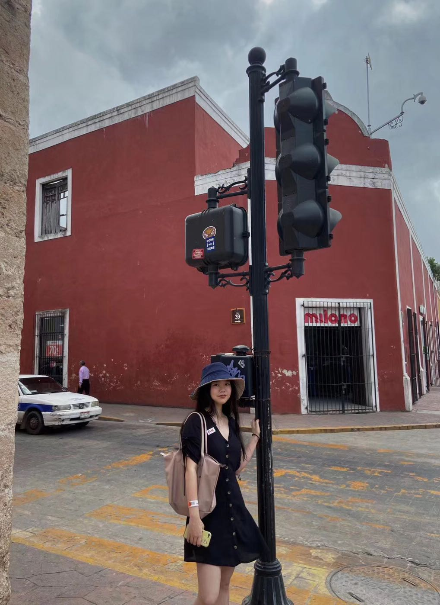

## Welcome! I'm Yunxi~

Welcome to my website! I am Yunxi and double major in Statistics and Economics. I am interested in investment and risk management by analying data.Therefore, I plan to apply for a graduate program in October and field in financial engineering or statistics. I like reading, watching movies, listening to music, travling and cooking. I love my family and miss them a lot!

---
## Contact Me

- [GitHub](https://github.com/Rosetta123)
- [Linkedin](https://www.linkedin.com/in/yunxichen/)
- [Resume](resume.pdf) 

---
## Professional Blog
I just learned from my course STAT 385 which is a funny and usefull programming course teaching me R language, I am learning Tidyverse to do data analysis. By now I make a progress to use github and R language which I believe that some day I could be a code guru.

Here are two projects I have done in STAT 385 and a independent study draft which I just start it with my friend foucsing on effects of COVID-19 of East-Asia economy.

- [Project 1](hw01.html)

- [Project 2](hw02.html)

- [Independent Study](independent study.pdf)

